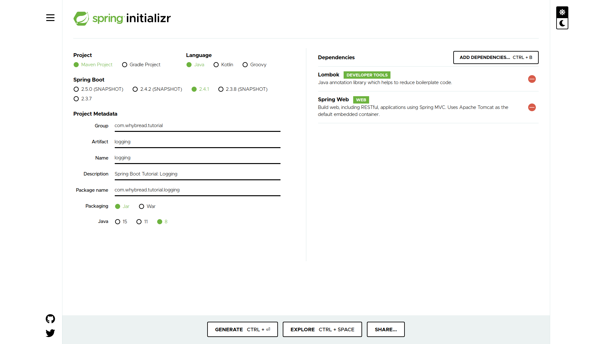

# Chapter 02: Logging

In this chapter, we will study how to make a simple web application with customized logging using **@Slf4j** annotation. If you wonder how to customize your logging, go to [Logging customization](#logging-customization)

## Make a new Spring Boot project

Make a new maven project using [**Spring Initializr**](https://start.spring.io/). Add `spring-boot-starter-web` and `lombok`to the dependencies just as below.

You can also refer to the [`pom.xml`](./pom.xml).

If you want to ignore log file in your **git repository**, you can add this fragment inside your `.gitignore` file.

	### Logging ###
	**/logs/
	*.log

## Make your own Controllers
To experience some **Spring Boot** supported functions for logging, we better make multiple packages. However, we will only make simple Controllers in this chapter. Thus, we're going to make three controller packages.
Create packages: `com.whybread.tutorial.logging.controllers1`, `com.whybread.tutorial.logging.controllers2` , and `com.whybread.tutorial.logging.controllers3` .
> **Note**: `com.whybread.tutorial.logging` must be replaced with the name of yours which you chose in the previous section.

There is only one simple Controller implemented in each package with `@RestController`, `@RequestMapping`, and `@Slf4j` annotations. 

- [`@RestController`](https://docs.spring.io/spring-framework/docs/current/javadoc-api/org/springframework/web/bind/annotation/RestController.html): Types that carry this annotation are treated as controllers where `@RequestMapping` methods assume [`@ResponseBody`](https://docs.spring.io/spring-framework/docs/current/javadoc-api/org/springframework/web/bind/annotation/ResponseBody.html "annotation in org.springframework.web.bind.annotation") semantics by default.
- [`@RequestMapping`](https://docs.spring.io/spring-framework/docs/current/javadoc-api/org/springframework/web/bind/annotation/RequestMapping.html): Annotation for mapping web requests onto methods in request-handling classes with flexible method signatures.
- [`@Slf4j`](https://projectlombok.org/api/lombok/extern/slf4j/Slf4j.html): Causes lombok to generate a logger field. Especially it creates `private static final org.slf4j.Logger log = org.slf4j.LoggerFactory.getLogger(LogExample.class);`.

So three Controllers are same, all they do is handling their own mapped URL. When a request is delivered to a certain Controller, it leaves a few logs and returns a very simple String like 'Hello Index'.

## Logging customization

Visit them: http://localhost:8080/, http://localhost:8080/verified, and http://localhost:8080/safe.

Whenever you visit your web application, you can see the logs displayed in your console with default logging level (INFO).

However, you might need to customize the logging for your project. It would be easy to study with examples. If so, look up the files: [`src/main/resources/application.yml`](./src/main/resources/application.yml) (read it first) and [src/main/resources/logback-spring.xml](./src/main/resources/logback-spring.xml). A lot of information to help your understanding are written in comments.

