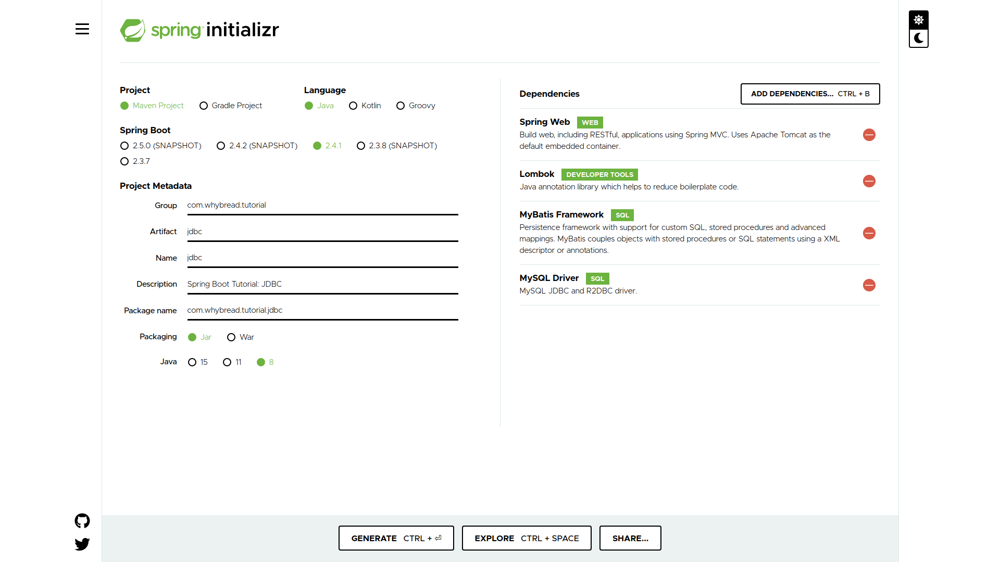

# Chapter 03: JDBC

In this chapter, we will study how to communicate with your **Database** in a **Spring Boot** application, especially using **MyBatis**.

Focus on how to modify the configurations of [`DataSource`](https://docs.oracle.com/javase/7/docs/api/javax/sql/DataSource.html) and [`SqlSessionFactory`](https://mybatis.org/mybatis-3/apidocs/org/apache/ibatis/session/SqlSessionFactory.html).

## Set up the Database

As there are a lot of materials to set up a database, so I will not explain how to do it. (However, I got a good example for Korean: [Docker Mysql 이미지로 DB 연동하기](https://devpouch.tistory.com/102))

> Note: The source codes are made under the assumption that your database is open at `localhost:3306`. So if you need, you can modify the url, which is located in [`application.yml`](./src/main/resources/application.yml)

In this project, it is assumed that you're going to use 2 databases, which are `db-local-1` with `domestic-users` table and `db-local-2` with `foreign-users` table. The other properties including `url` and `username` are all stated under the `application.yml`'s `spring.datasource` properties.

Also you can refer to [`domestic-user-mapper.xml`](./src/main/resources/mapper/db-local-1/domestic-user-mapper.xml) and [`foreign-user-mapper.xml`](./src/main/resources/mapper/db-local-2/foreign-user-mapper.xml) to see the queries.

To generate a table properly matched with the DTO in the source, I provide a `.sql` file for you: [`table-generator-domestic-user.sql`](./table-generator-domestic-user.sql) and [`table-generator-foreign-user.sql`](./table-generator-foreign-user.sql). Please use the first one in the `db-local-1`, and the other in `db-local-2`.
> You can use the `.sql` file with the command `mysql> source file-name.sql` in your database.

## Make a new Spring Boot project

Make a new maven project using  [**Spring Initializr**](https://start.spring.io/).

Add  `spring-boot-starter-web`,  `lombok`, `mybatis-spring-boot-starter`and  `mysql-connector-java`to the dependencies just as below.



You can also refer to the [`pom.xml`](./pom.xml).

## WHAT TO DO
It is a very simple procedure that you can follow to understand what this project has done.
For each step, you can look up the files and read them with the comments.

### 1. Read `application.yml`
First of all, go and read the properties in `application.yml`. There are almost every information about the data source.


### 2. Read `mapper.xml`
Then you can read mappers that are located under [`src/main/resources/mapper`](./src/main/resources/mapper) directory.
It would help you to understand the structure of tables you should use and queries to do.

### 3. Read `.java` source codes
After those two steps, you know what we want to do. Then all you need is to know how to implement the functions within the Spring Boot Application.

There are a lot of comments to help your understand. I recommend you to read in this order:
1. `com.whybread.tutorial.jdbc.controller.DomesticUserController.java`
2. `com.whybread.tutorial.jdbc.service.DomesticUserService.java`
3. `com.whybread.tutorial.jdbc.data.dto.DomesticUserDto.java`
4. `com.whybread.tutorial.jdbc.data.dao.domesticuser.DomesticUserDao.java`
5. `com.whybread.tutorial.jdbc.data.config.Local1DataConfiguration.java`

These are the classes dealing with `db-local-1`. The other classes are almost same codes dealing with `db-local-2`.

The remaining parts are additional to solve the curiosity that arises after implementation.  If you understand everything, there is no need to read more.

## Using @ConfigurationProperties

This annotation helps you to use external configuration.

**De-Annotated Version**
```
@Bean
public DataSource dataSource() 
{
	DataSourceBuilder dataSourceBuilder = DataSourceBuilder.create();
	dataSourceBuilder.driverClassName("com.mysql.cj.jdbc.Driver");
	dataSourceBuilder.url("jdbc:mysql://localhost:3306/test");
	dataSourceBuilder.username("dbuser");
	dataSourceBuilder.password("dbpass");
	return dataSourceBuilder.build();
}
```
> Reference: https://howtodoinjava.com/spring-boot2/datasource-configuration/

The above code can be changed as below.

**Annotated Version**
```
@Bean
@ConfigurationProperties("custom.namespace")
public DataSource dataSource() {
	return DataSourceBuilder.create().build();
}
```
> Reference: https://docs.spring.io/spring-boot/docs/current/reference/htmlsingle/#howto-configure-a-datasource


with `application.yml`
```
custom:
	namespace:
		driver-class-name: com.mysql.cj.jdbc.Driver
		url: jdbc:mysql://localhost:3306/test
		username: dbuser
		password: dbpass
```


## What is `SqlSessionFactory`?

To construct a `SqlSessionTemplate` object, we must need a  `SqlSessionFactory` as an argument.
`SqlSessionTemplate`  is an implementation of `SqlSession` interface, and it is used to do your query.

`SqlSession`: The primary Java interface for working with **MyBatis**. Through this interface you can execute commands, get mappers and manage transactions.
> For more information: [SqlSessionTemplate (mybatis-spring 2.0.6 API)](https://mybatis.org/spring/apidocs/org/mybatis/spring/SqlSessionTemplate.html), [SqlSessionFactory (mybatis 3.5.6 API)](https://mybatis.org/mybatis-3/apidocs/org/apache/ibatis/session/SqlSessionFactory.html), [SqlSession (mybatis 3.5.6 API)](https://mybatis.org/mybatis-3/apidocs/org/apache/ibatis/session/SqlSession.html)

 

## Without MyBatis

If you don't use **MyBatis**, you might deal with your own `JdbcTemplate` object in a tradional way. You would implement data accessing methods using `JdbcTemplate.query` method.

Make your customized `JdbcTemplate` Bean first.
```
@Bean
public JdbcTemplate myJdbcTemplate(@Qualifier("myDataSource") DataSource ds) {
	return  new  JdbcTemplate(ds);
}
```
Then implement your methods with it.
```
@Autowired
@Qualifier("myJdbcTemplate")
private JdbcTemplate myJdbcTemplate;
public  List getAllUser()  {
	List list = myJdbcTemplate.query(selectUserSql,  new UserRowMapper());
	return list;
}
```
For more information: [Reference](https://www.jackrutorial.com/2018/08/multiple-datasource-in-spring-boot.html)

