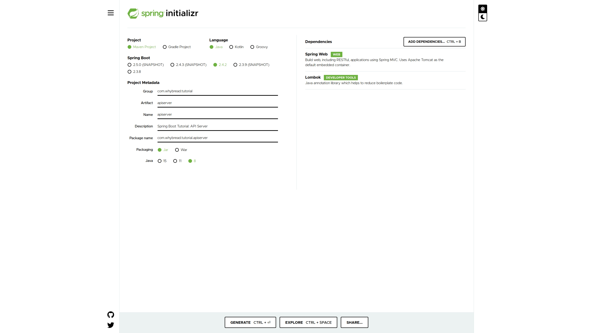

# Chapter 04: API Server

In this chapter, we will study how to make a **Spring Boot** application providing a simple API.

## Design your API
The first thing you should do is to design your API.

My server supports two URL:
* `/users`: A list of all users.
* `/users/{userID}`: A user found by `userID`, while `userID` must be a positive integer.

While I only provide very few data in this tutorial, I referred to the two materials below to name them.

*RESTful API design*:
* Korean: [RESTful API 디자인(네이밍) :: 어제보다 더 나은 개발자 되기](https://hankkuu.tistory.com/21)
* English: [Best practices for REST API design - Stack Overflow Blog](https://stackoverflow.blog/2020/03/02/best-practices-for-rest-api-design/)

You also have to design your implementation. I used an `ApiResult` class as a response for every API calls.
Reference: [SpringBoot2로 Rest api 만들기(5) – API 인터페이스 및 결과 데이터 구조 설계](https://daddyprogrammer.org/post/404/spring-boot2-design-api-interface-and-data-structure/)

## Pseudo generated data
In this chapter, persistence is not our concern. So we will implement the API with pseudo generated data.

For example, `{"userId":123,"userName":"User[123]","userEmail":"User[123]@gmail.com"}` will be a response data for a request to `/users/123`.

## Make a new Spring Boot project

Make a new maven project using  [**Spring Initializr**](https://start.spring.io/).

Add  `spring-boot-starter-web`and  `lombok` to the dependencies just as below.

You can also refer to the [`pom.xml`](./pom.xml).

## Implement your API
In the Java source codes, there are enough comments to help your study. I recommend you to read in this order:

1. `com.whybread.tutorial.apiserver.controller.UserController.java`
2. `com.whybread.tutorial.apiserver.dto.User.java`
3. `com.whybread.tutorial.apiserver.dao.UserDao.java`
4. `com.whybread.tutorial.apiserver.model.ApiResult.java`
5. `com.whybread.tutorial.apiserver.service.UserService.java`

Additional informations are commented in the source codes.

> Caution: When you look up [`application.yml`](./src/main/resources/application.yml), you would recognize that this application uses port `8888`. It is to study linked with chapter 05. So you should test your application through `http://localhost:8888/users`.

## Swagger
Although I didn't use [**Swagger**](https://swagger.io/docs/), I recommend to use it. It makes easy for you to design, build, and document your API.
