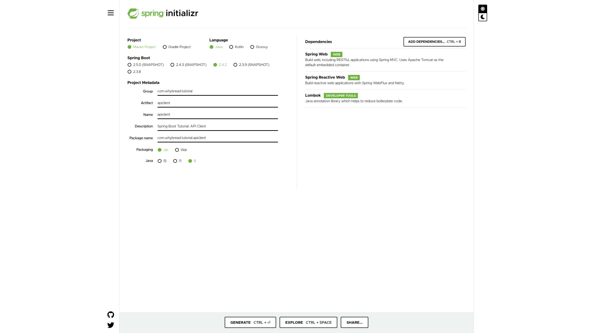

# Chapter 05: API Client

In this chapter, we will study how to make a **Spring Boot** application that can use other APIs through HTTP request with [`WebClient`](https://docs.spring.io/spring-framework/docs/current/javadoc-api/org/springframework/web/reactive/function/client/WebClient.html), which is strongly recommend to be used instead of `RestTemplate`.

## Make a new Spring Boot project

Make a new maven project using  [**Spring Initializr**](https://start.spring.io/).

Add  `spring-boot-starter-web`, `spring-boot-starter-webflux` and  `lombok` to the dependencies just as below.

You can also refer to the [`pom.xml`](./pom.xml).

## Implement your application
In the Java source codes, there are enough comments to help your study. I recommend you to read in this order:

1. `com.whybread.tutorial.apiclient.controller.ClientController.java`
2. `com.whybread.tutorial.apiclient.service.ClientService.java`
3. `com.whybread.tutorial.apiclient.configuration.WebClientConfiguration.java`
4. `application.yml`

Additional informations are commented in the source codes.

## WebClient
Traditionally, `RestTemplate` was a major way to perform HTTP requests in a Spring Boot application. However, as of Spring Boot 5.0, it is in maintenance mode, with only minor requests for changes and bugs to be accepted going forward. So Spring Boot strongly recommend us to consider using `WebClient`.
