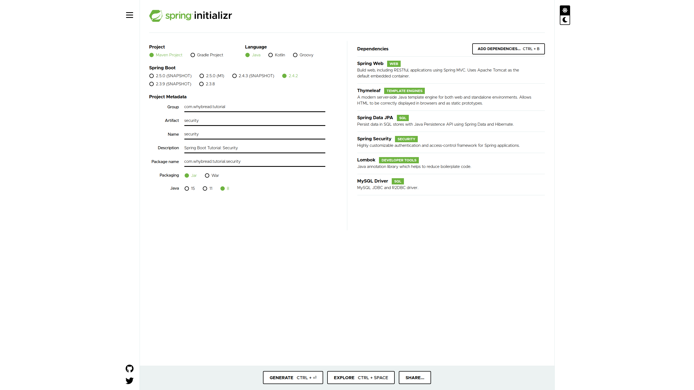

# Chapter 06: Security

In this chapter, we will study how to use **Spring Security** on your application.

Through this, you will learn how to **authenticate** and **authorize** requests in both HTTP & method level.

## Make a New Spring Boot Project

Make a new maven project using [**Spring Initializr**](https://start.spring.io/).

Add the dependencies just as below.



You can also refer to [`pom.xml`](./pom.xml).


## Prepare for JPA

If you don't want to handle persistence, you can also test the features of Spring Security with pseudo data. However, in this project, JPA is used to access to  `User` data.

### Database

In my case, I used `mysql` for this project's DBMS.

I made a database named `db_bakery` (please use your own name).
```
mysql> CREATE DATABASE `db_bakery`;
```
Then I used a `.sql` file to configure a table `USER_TB`. The file is provided in the project root: [table-generator-user.sql](./table-generator-user.sql). In my case, the full location of the file was `/var/lib/mysql/my-data/table-generator-user.sql`. You should write your file's location instead.
```
mysql> USE `db_bakery`;
mysql> SOURCE /var/lib/mysql/my-data/table-generator-user.sql;
```
You can handle the table now.
```
mysql> SHOW COLUMNS FROM `USER_TB`;
mysql> SELECT * FROM `USER_TB`;
```

The database's current state is what the project is assuming. If you want to modify the database schema, you should be aware of changing the Java codes too.

### Write application.yml
You can refer to [application.yml](./src/main/resources/application.yml) file.

The file consists of information for persistence. It's short and clear to understand, and some references used to implement is provided as a comment. You need to change `spring.datasource.*` properties to suit your case.


## Project Tree for the Web Application
```
06-security
├─ pom.xml
├─ table-generator-user.sql
└─ src
   └─ main
      ├─ java
      │  └─ com.whybread.tutorial.security
      │     ├─ UserresourceApplication.java
      │     ├─ config
      │     │  ├─ WebMvcConfig.java
      │     │  └─ WebSecurityConfig.java
      │     ├─ controller
      │     │  ├─ AdminController.java
      │     │  ├─ HomeController.java
      │     │  └─ UserController.java
      │     ├─ dto
      │     │  └─ UserDto.java
      │     ├─ entity
      │     │  └─ UserEntity.java
      │     ├─ repository
      │     │  └─ UserRepository.java
      │     └─ service
      │        ├─ AuthenticationService.java
      │        └─ UserService.java
      └─ resources
         ├─ application.yml
         ├─ public
         │  └─ css
         │     └─ style.css
         ├─ static
         └─ templates
            ├─ index.html
            ├─ login.html
            ├─ register.html
            └─ removeUser.html
```

## Project Description

This project can be divided into four key parts. In this chapter, it is briefly introduced what those are.

For details, please read the source codes with comments. References are also in the comments.

### 1. JPA
To manage persistence in java code easily, two classes are used for JPA. Just a simple `Entity` class and a `Repository` class.

- `com.whybread.tutorial.security.entity.UserEntity`
- `com.whybread.tutorial.security.entity.UserRepository`

## 2. Spring Security (Authentication & Authorization)
First of all, `WebSecurityConfig` is a `@Configuration` annotated class for Spring Security configuration. It mainly deals with HTTP authentication and authorization. Also, Spring Security based login is covered.

For the Spring Security authentication, we must implement `UserDetialsService` interface, and `UserService` is my custom implementation. It implements `loadUserByUsername(String username)` method that returns a `@UserDetails` object. There are also a few `Service` methods.

`AuthenticationService` is used for method level authorization. With a `@PreAuthorize` annotation, you can use your own condition to authorize the user when a method is invoked.

- `com.whybread.tutorial.security.config.WebSecurityConfig`
- `com.whybread.tutorial.security.service.UserService`
- `com.whybread.tutorial.security.service.AuthenticationService`

## 3. Request Mapping (SpEL)
I wanted to give users their own page just like Github. To do that, `UserController` class leveraged `@RequestMapping` annotation's strong `SpEL` support.
`com.whybread.tutorial.security.controller.UserController`

## 4. Static resources
We can use `WebMvcConfig` class to map URLs to your own resource location.
`com.whybread.tutorial.security.config.WebMvcConfig`

## Etc

### Templates (`.html`)
There are a few HTML files in [`/src/main/resources/templates`](./src/main/resources/templates) directory. They are not mentioned above as it is not important to understand this chapter, but you can see them if you want.

### URLs
As the application doesn't serve a well-made kind view, you should know some URLs to test it.

`/`: Index page
`/index`: Redirects to index page.
`/login`: Login page, redirects to index page if already logged in.
`/logout`: Logout page, redirects to index page after logout.

`/admin`: Admin page that users can only access with a role `ROLE_ADMIN`.
`/public`:All public resources would be located under here. (e.x. `public/css/style.css`)

`/test`:  A user page of the user '`test`'. Open to all users.
`/test/settings`: A user setting page of the user '`test`'. Open to the user '`test`' only (and users with a role `ROLE_ADMIN`).
