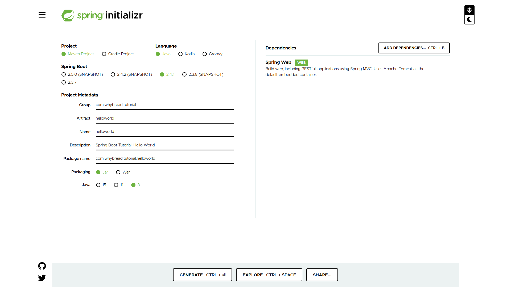

# Chapter 01: Hello World

In this chapter, we will study how to make a simple web application prints 'hello world' using **Spring Boot**.

## Make a new Spring Boot project

Make a new maven project using [**Spring Initializr**](https://start.spring.io/). Add `spring-boot-starter-web` to the dependencies just as below.



You can also refer to the `pom.xml` which is located in this chapter's root directory.

## Create a static resource.

Create a simple `index.html` that helps your application say hello to the world.

```
<!DOCTYPE  html>

<html  lang="en">
<head>
	<meta  charset="UTF-8">
	<title>Hello World</title>
</head>
<body>
Hello, world!
</body>
</html>
```

Location this file at `<project-root>/src/main/resources/static/`.
As it is one of the directories for static files in **Spring Boot** default, you don't have to modify any configurations.

## Visit now.

http://localhost:8080/ will show that your simple **Spring Boot** application works well.

> **Congratulations!**  Now you've done to make a simple **Spring Boot** application!

## Using the `@SpringBootApplication` annotation

You can find a `@SpringBootApplication` annotation in your `<your-project-name>Application.java`, and this annotation enables three features. You can replace it with a combination of these three annotations.
- `@EnableAutoConfiguration`: enable **Spring Boot**’s auto-configuration mechanism
- `@ComponentScan`: enable `@Component` scan on the package where the application is located (see the best practices)
- `@Configuration`: allow to register extra beans in the context or import additional configuration classes

For more information, visit [Spring Boot Reference Documentation](https://docs.spring.io/spring-boot/docs/2.4.1/reference/htmlsingle/#using-boot-using-springbootapplication-annotation)

